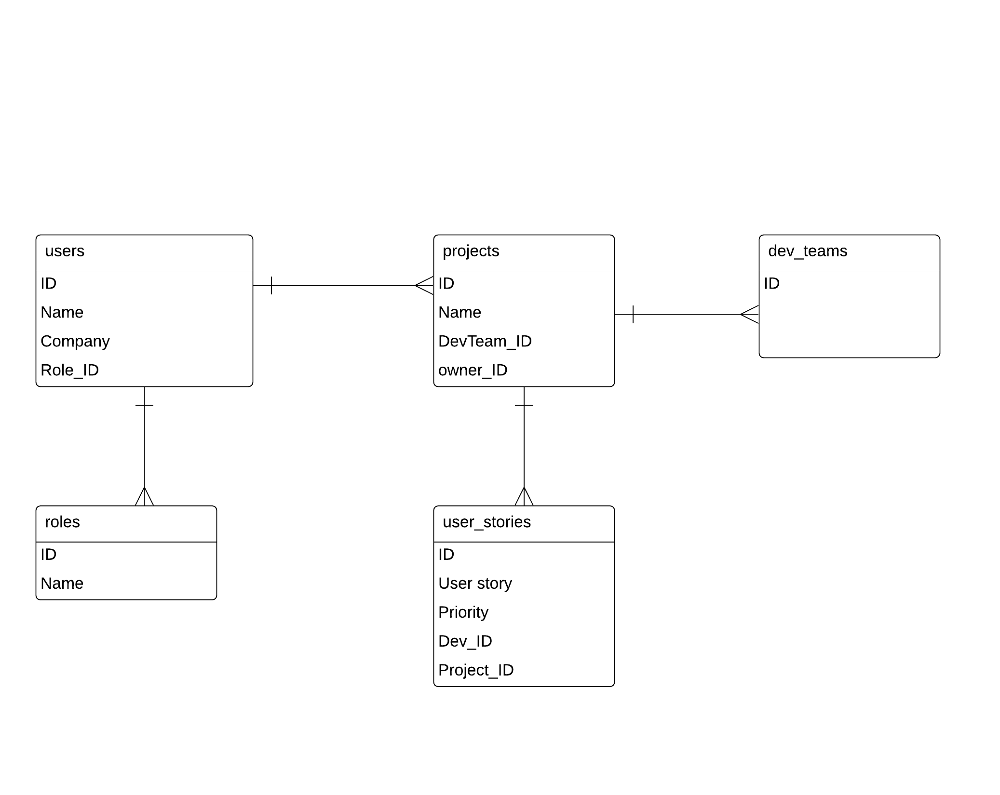

# PRG02 5 MVC project

School project to dive into using frameworks for faster development. I will be using the Laravel framework for this project.

### Project description
Time tracker app for developers to keep track of their time per user stories/function requirements.

The roles are: project owners, project managers, developers.

Project owners can create projects and assign it to a development team. Development team has a project manager who can create user stories and add priorities/velocities for each story. 
Developers also has role levels. Each developer is assigned a role from 1 to 3 (with 1 being the junior developer). Developers can select one user story per turn based on their developer level and user story priority. Low level developers can not select high priority user story unless manually assigned by project manager.

### ERD 
ERD v1.

### Errors I faced during development:
1. **Foreign key constraints error** : when I added a foreign key to the users table I got the **_General error: 1215 Cannot add foreign key constraint"_** error. This is caused because the users table was created first before the other table with the key I want. How migrations works is that tables are created based on which one was made first using the artisan make:migration command. I solved this by simply running the migrate --path=.... command on the table I want first, followed by the rest.

### TODOS:
1. Test the user table with the users_roles table.
2. Add the rest of the tables based on the ERD.